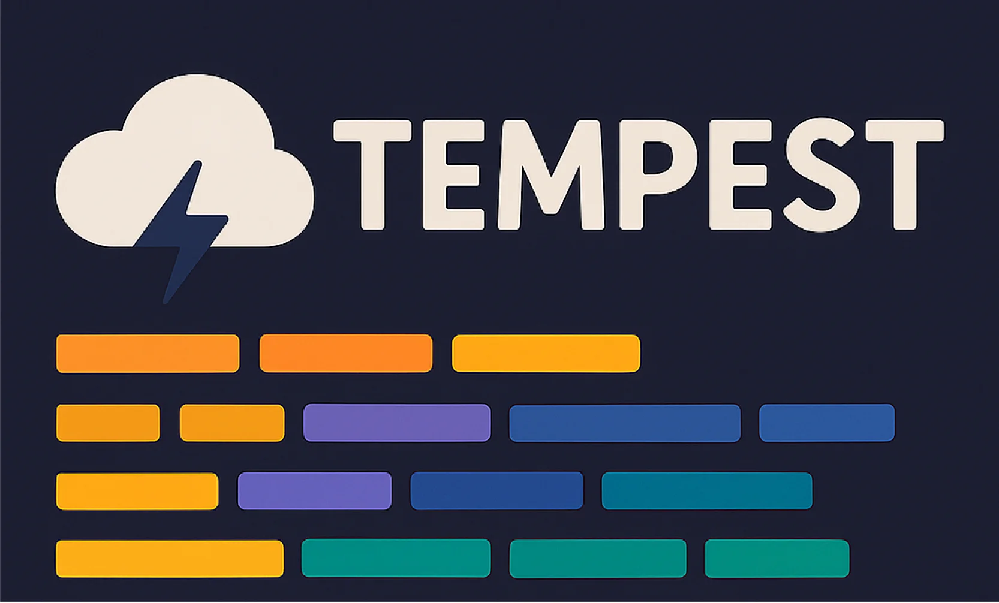

# Tempest

<p align="center">
  
</p>

**Modular sequence annotation using length-constrained CRFs with PWM priors and ensemble modeling.**

Tempest is inspired by Tranquillyzer, designed for annotating biological sequences (e.g., nanopore reads) with structured elements like adapters, UMIs, barcodes, and inserts using deep learning.

## Features

- **CNN-BiLSTM-semi-Markov CRF Architecture**: Captures local motifs, long-range dependencies, and leverages known segment lengths/boundaries
- **Length-Constrained CRF**: Lightweight semi-Markov approximation for segment-length priors
- **Vectorized Implementation**: Fully XLA-compatible with efficient O(T) inference
- **Constraint Weight Ramping**: Gradual introduction of length penalties over epochs
- **PWM-Based Priors**: Incorporates position weight matrices (e.g., for ACC detection)
- **Ensemble Modeling**: Bayesian Model Averaging for robust predictions
- **Visualization**: Colored sequence annotations (inspired by Tranquillyzer)
- **Configuration**: YAML-based configs for reproducible experiments

## Installation

```bash
# Clone the repository
git clone https://github.com/biobenkj/tempest.git
cd tempest

# Install dependencies
pip install -r requirements.txt
```

## Quick Start

### 1. Configure Your Experiment

Edit `config.yaml`:

```yaml
model:
  vocab_size: 5  # A, C, G, T, N
  embedding_dim: 128
  lstm_units: 128
  lstm_layers: 2
  cnn_filters: [64, 128]
  cnn_kernels: [3, 5]
  num_labels: 10
  max_seq_len: 512
  use_cnn: true
  use_bilstm: true
  use_crf: true
  
  # Length constraints for semi-Markov approximation
  length_constraints:
    UMI: [8, 8]      # UMI must be exactly 8bp
    ACC: [6, 6]      # ACC must be exactly 6bp  
    BARCODE: [16, 16] # Barcode must be exactly 16bp
  
  constraint_weight: 5.0
  constraint_ramp_epochs: 5  # Ramp penalty from 0 to full over 5 epochs

simulation:
  sequence_order: ['ADAPTER5', 'UMI', 'ACC', 'BARCODE', 'INSERT', 'ADAPTER3']
  num_sequences: 10000

training:
  epochs: 20
  learning_rate: 0.001
  batch_size: 32

ensemble:
  method: 'bma'
  num_models: 5
```

### 2. Build and Train a Model with Length Constraints

```python
from tempest.core import build_model_from_config
from tempest.utils import load_config
import sklearn.preprocessing as sp

# Load configuration
config = load_config('config.yaml')

# Create label binarizer for label mapping
labels = ['ADAPTER5', 'UMI', 'ACC', 'BARCODE', 'INSERT', 'ADAPTER3', 'PAD']
label_binarizer = sp.LabelBinarizer()
label_binarizer.fit(labels)

# Build model with length constraints
model = build_model_from_config(config)

# For training with length penalties, wrap the model
from tempest.core import build_model_with_length_constraints

wrapped_model = build_model_with_length_constraints(
    base_model=model,
    length_constraints=config.model.length_constraints,
    constraint_weight=config.model.constraint_weight,
    label_binarizer=label_binarizer,
    max_seq_len=config.model.max_seq_len,
    constraint_ramp_epochs=config.model.constraint_ramp_epochs
)

# Compile and train
wrapped_model.compile(
    optimizer='adam',
    loss=None,  # Loss is computed internally
    metrics=['accuracy']
)

# Train with constraint weight ramping
for epoch in range(config.training.epochs):
    wrapped_model.on_epoch_begin(epoch)
    wrapped_model.fit(X_train, y_train, 
                     batch_size=config.training.batch_size,
                     epochs=1)
```

### 3. Direct Usage of Length-Constrained CRF

```python
from tempest.core import build_cnn_bilstm_crf

# Build model with integrated length constraints
model = build_cnn_bilstm_crf(
    vocab_size=5,
    embedding_dim=128,
    lstm_units=128,
    num_labels=10,
    use_crf=True,
    length_constraints={
        'UMI': (8, 8),
        'ACC': (6, 6),
        'BARCODE': (16, 16)
    },
    constraint_weight=5.0
)
```

## Mathematical Foundation

### Length-Constrained CRF (Semi-Markov Approximation)

The length-constrained CRF extends standard linear-chain CRFs with a differentiable regularization term that enforces segment length priors:

#### Standard CRF Loss
```
L_CRF(x, y; θ) = -log P(y | x; θ)
```

#### Length Penalty
For each constrained label c with segments of lengths {L_i^(c)}, the quadratic penalty is:
```
Ω_c = (1/N_c) Σ_i [(L_min^(c) - L_i^(c))_+^2 + (L_i^(c) - L_max^(c))_+^2]
```
where (z)_+ = max(0, z) and N_c is the number of segments.

#### Combined Objective
```
L(x, y; θ) = L_CRF(x, y; θ) + λ·Ω(y_pred)
```

This formulation:
- Maintains O(T) inference complexity (vs O(T·L_max) for true semi-Markov CRFs)
- Uses Viterbi decoded sequences for penalty computation
- Applies constraint weight ramping: λ(epoch) = λ_max × min(epoch/ramp_epochs, 1)
- Is fully vectorized and XLA-compatible for efficient GPU/TPU execution

### Key Implementation Features

1. **Vectorized Run Length Extraction**: Efficiently computes segment lengths using TensorFlow operations
2. **XLA Compilation**: Fully compatible with `@tf.function(jit_compile=True)`
3. **Constraint Weight Ramping**: Gradually introduces penalties to avoid training instabilities
4. **Viterbi-based Penalties**: Uses actual decoded sequences rather than potentials

## Architecture

```
Input Sequence (A,C,G,T,N)
         ↓
    Embedding (128d)
         ↓
    CNN Layers (extract motifs)
         ↓  
    BiLSTM Layers (long-range dependencies)
         ↓
    Linear Projection
         ↓
  Length-Constrained CRF
    - Standard CRF transitions
    - Length penalty Ω(y)
    - Constraint ramping
         ↓
  Viterbi Decoded Labels
```

## Project Structure

```
tempest/
├── core/                   # Model architectures and layers
│   ├── __init__.py
│   ├── models.py          # CNN-BiLSTM-CRF builder
│   ├── length_crf.py      # Length-constrained CRF implementation
│   └── pwm.py             # PWM detection module
├── data/                   # Data processing
│   ├── simulator.py       # Training data simulation
│   ├── preprocessor.py    # FASTQ preprocessing
│   └── generators.py      # TensorFlow data generators
├── training/               # Training utilities
│   ├── trainer.py         # Single model training
│   └── ensemble.py        # Ensemble/BMA training
├── inference/              # Inference pipeline
│   ├── annotator.py       # Sequence annotation
│   └── postprocess.py     # Post-processing
├── visualization/          # Visualization tools
│   └── plots.py           # Annotation plots
├── utils/                  # Utilities
│   ├── config.py          # Configuration management
│   └── io.py              # File I/O
├── examples/               # Example scripts
└── docs/                   # Documentation
```

## Performance Characteristics

| Aspect | Standard CRF | True Semi-Markov CRF | Length-Constrained CRF |
|--------|-------------|---------------------|----------------------|
| Latent Structure | Token-wise | Segment-wise | Token-wise (decoded segments) |
| Length Modeling | None | Explicit F(y_s, ℓ_s) | Implicit via Ω(y) |
| Inference Complexity | O(T) | O(T·L_max) | O(T) |
| Gradients through lengths | No | Yes | No |
| Practical behavior | Label smoothing | Exact segment control | Segment-length regularization |

## Requirements

- Python ≥ 3.8
- TensorFlow ≥ 2.10
- NumPy
- Pandas
- BioPython
- tf2crf
- tensorflow-addons
- scikit-learn
- Matplotlib (for visualization)

## Citation

If you use Tempest in your research, please cite:

```bibtex
@software{tempest2025,
  title = {Tempest: Length-Constrained CRFs for Sequence Annotation},
  author = {Johnson, Ben},
  year = {2025},
  url = {https://github.com/biobenkj/tempest}
}
```

## Contributing

Tempest is under active development. Contributions welcome!

## License

MIT License

## Contact

Ben Johnson <ben.johnson@vai.org>
